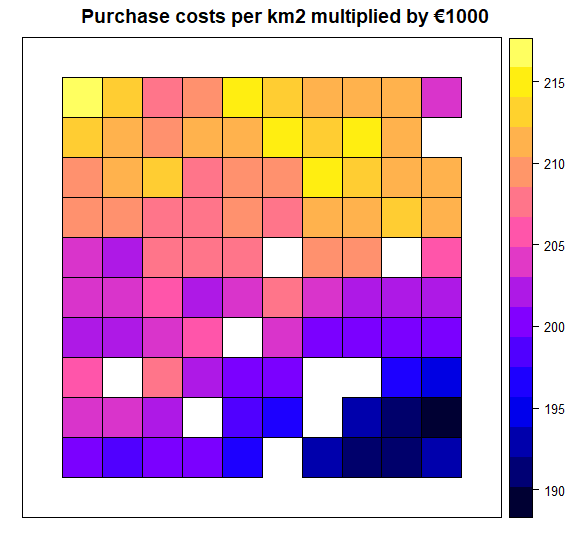
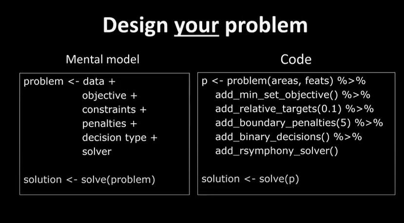

<div id="top"></div>


<!-- PROJECT LOGO -->
<br />
<div align="center">
  
  </a>

  <h3 align="center">Using the PrioritizR Package</h3>

  <p align="center">
    By: Daniël Kooij
  </p>
</div>


<!-- TABLE OF CONTENTS -->
<details>
  <summary>Table of Contents</summary>
  <ol>
    <li>
      <a href="#PPP">Preparing your first PriotizR Project</a>
      <ul>
        <li><a href="#built-with">Built With</a></li>
      </ul>
    </li>
    <li>
      <a href="#getting-started">Getting Started</a>
      <ul>
        <li><a href="#prerequisites">Prerequisites</a></li>
        <li><a href="#installation">Installation</a></li>
      </ul>
    </li>
    <li><a href="#usage">Usage</a></li>
    <li><a href="#roadmap">Roadmap</a></li>
    <li><a href="#contributing">Contributing</a></li>
    <li><a href="#license">License</a></li>
    <li><a href="#contact">Contact</a></li>
    <li><a href="#acknowledgments">Acknowledgments</a></li>
  </ol>
</details>


<!-- PPP -->
## Preparing your first PriotizR Project

In this section, we are going to explore step by step how linear programming (LP) can be implemented on a spatial scale. For this purpose, we will imagine the aforementioned task; indicating which areas of a forest should be protected in order to preserve .....the maximum amount of biodiversity? Suppose the forest in question is a perfect square of 10 by 10 kilometers, divided into grid cells of 1 km<sup>2</sup>. Each grid cell of forest may attain the _preserved_ status, but there can only be a limited amount of grid cells that can be preserved due to some constraint(s).

<br />

> Question 1. What might be a limiting factor for preservation? I.e. What could be a reason that we cannot preserve the whole forest?

<br />
<details>
<summary>Answer Q1.</summary>
There can be many limiting factors. Often there is money involved and the conservation costs are too high. However, there may be other reasons, such as: The entire forest cannot be managed and patrolled, or preservation could mean the preserved area would be fenced off and the government decided that at least _X_% of the forest should be remain open to the public. 
</details>

<br />

> Question 2. What kind of data (variables) would you like to know about each grid cell of forest to determine if it should be preserved or not? Name three different types of variables.

<br />
<details>
<summary>Answer Q2.</summary>
Depending on your LP problem, numerous types of variables can be of interest. In the case of this forest preservation task some examples can be: The number of trees in a grid cell (quantity), the number of endangered species present (quality), the (geo)diversity in the abiotic environment, the cost of protecting the 1km<sup>2</sup>, the distance to disturbances such as roads, the nutrient & water availability etc.
</details>

<br />

Now that we have a basic understanding of the data we could use to reach our objective (OBJECTIVE IS NOT CLEAR YET, MAXIMUM BIODIVERSITY?) of preserving the ... and possible constraints that limit our options, we can check how our conservation task would look in real life. In order to do so, we will make use of data that is already available in the PrioritizR package. Therefore, fire up Rstudio and load the PrioritizR library, now that we are at it, also load the Gurobi library which we will use to solve our LP problem later on.

```R
# load packages
library(prioritizr)
library(gurobi)
```

<br />

### Inspecting the data

The data for our forest in question is divided into two parts; on the one hand we have the constraint(s) and data about whether a grid cell can be preserved or not. On the other hand we have different variables of interest that we can use to indicate which grid cells would be optimal to preserve in order to satisfy our objective to the fullest. In this case, the constraint is a matter of money, whereas we have a limited amount of cash available to preserve this forest and each grid cell costs a certain amount of money to be preserved. As you can imagine, the costs of preservation varies across the grid. This might be due to land costs; the forest is partly owned by foresters that should be bought out or compensated. Or this might be due to accessibility; some areas are harder to reach and the costs are higher to implement necessary magament practices. Let's assume the former scenario where land must be purchased and the costs are in thousands of euros per km<sup>2</sup>. With this in mind, we are going to take a look at the forest, but first we have to load the data:

```R
# load costs and planning unit data
data(sim_pu_polygons)
```

<br />

The data we just loaded will (hopefully) appear in the environment tab in the topright corner of your screen called _sim_pu_polygons_. This R object contains data about three variables for every single grid cell. The first variable is the cost to purchase each grid cell, which we going to check out now. This data is presented as polygons in a so called spatial vector format. For now that does not seem to make much difference as we will see a perfectly square forest with equally sized grid cells. However, this will come in handy when working with real data, as our world is often divided into areas that follow natural or man-made boundaries. By using this spatial vector format, it is possible to define polygons precisely matching the area in question, which we will see later on when we apply this to a case study. The function _spplot_ is able to visualize these polygons, now visualize the purchase costs per grid cell using the following code:

```R
# Show the purchase costs per km2
spplot(sim_pu_polygons, "cost", main = "Purchase costs per km2 multiplied by €1000",
       xlim = c(-0.1, 1.1), ylim = c(-0.1, 1.1))
```

<br />

This will have plotted the purchase costs visually using a gradient in the bottomright corner of Rstudio. The yellow areas are of high costs, while the blue areas are relatively cheaper (figure 2). The white grid cells cannot be bought, these could for instance consist of waterbodies that are not part of the forest and our management practices and are therefore not able to be preserved.

<br />
<br />

<div align="center">
  
  <br />
  <em>Figure 2. Overview of the purchasing costs of each square kilometer of forest</em>
</div>

<br />
<br />

It is also possible to access the data directly instead of visually inspecting the costs. First save the data of the polygons in a new variable using the code underneath, then use your existing knowledge about R to answer the following question.

```R
# Save the polygon data in an easily accessable variable
forest_cost <- sim_pu_polygons@data
```

<br />

> Question 3. What is the costs of the most expensive km<sup>2</sup> of forest? Mind the unit of measurement!

<br />
<details>
<summary>Answer Q3.</summary>
Using the function summary(forest_cost) for example, one can find that the maximum cost is €215900.
</details>

<br />

As you can see in the new _forest cost_ variable, there are also two other columns in the data; _locked_in_ and _locked_out_. The locked_in column describes whether a grid cell is already being protected or not. The locked_out column details whether a grid cell can be preserved at all, maybe there is a train track crossing the forest, which makes it impossible to protect the grid cells within which it lies. Now visualize the locked_in data similarly as how you visualized the purchase costs earlier, copy the code and change the necessary parts accordingly.

<br />

> Question 4. How many grid cells are already preserved?

<br />
<details>
<summary>Answer Q4.</summary>
If you count the colored cells in the visualized "locked-in" variable, one can find that the answer is 10.
</details>

<br />
<br />

### Feature data - work in progress

Conservation features are represented using a stack of raster data (i.e. RasterStack objects). A RasterStack represents a collection of RasterLayers with the same spatial properties (i.e. spatial extent, coordinate system, dimensionality, and resolution). Each RasterLayer in the stack describes the distribution of a conservation feature.

In our example, the sim_features object is a RasterStack object that contains 5 layers. Each RasterLayer describes the distribution of a species. Specifically, the pixel values denote the proportion of suitable habitat across different areas inside the study area. For a given layer, pixels with a value of one are comprised entirely of suitable habitat for the feature, and pixels with a value of zero contain no suitable habitat.

```R
# load feature data
data(sim_features)

# plot the distribution of suitable habitat for each feature
plot(sim_features, main = paste("Feature", seq_len(nlayers(sim_features))),
     nr = 2)
```

<br />

> Question 5. Upon visual inspection of the plots, which part of the forest would you not opt to preserve? <br />
> <br />
> a) The northeastern part <br />
> b) The northwestern part <br />
> c) The southeastern part <br />
> d) The southwestern part <br />

<br />
<details>
<summary>Answer Q2.</summary>
Answer A. The northwestern part is inefficient to preserve.
</details>

<br />

> Question 6. Why this area? <br />
> <br />
> a) This area has the highest costs. <br />
> b) This area is most unsuitable to preserve. <br />
> c) Both _a_ and _b_ are correct. <br />

<br />
<details>
<summary>Answer Q2.</summary>
Answer C. The area has the highest cost (the maximum amount of €215900) and also three of the features are highly unsuitable.
</details>

<br />

<!-- Problem -->
## Defining the problem

Let’s say that we want to develop a reserve network that will secure 15% of the distribution for each feature in the study area for minimal cost. In this planning scenario, we can either purchase all of the land inside a given planning unit, or none of the land inside a given planning unit. Thus we will create a new problem that will use a minimum set objective (add_min_set_objective), with relative targets of 15% (add_relative_targets), binary decisions (add_binary_decisions), and specify that we want to want optimal solutions from the best solver installed on our system (add_default_solver).

```R
# create problem
p1 <- problem(sim_pu_polygons, features = sim_features,
              cost_column = "cost") %>%
      add_min_set_objective() %>%
      add_relative_targets(0.15) %>%
      add_binary_decisions() %>%
      add_default_solver(gap = 0)
```

<br />
<br />

<div align="center">
  
  <br />
  <em>Figure X. How a problem definition translates into R code</em>
</div>

<!-- Cons Pros -->
## Constraints & Objectives

This solution is an improvement over the previous solution. However, it is also highly fragmented. As a consequence, this solution may be associated with increased management costs and the species in this scenario may not benefit substantially from this solution due to edge effects. We can further modify the problem by adding penalties that punish overly fragmented solutions (add_boundary_penalties). Here we will use a penalty factor of 300 (i.e. boundary length modifier; BLM), and an edge factor of 50% so that planning units that occur outer edge of the study area are not overly penalized.

This solution is even better then the previous solution. However, we are not finished yet. This solution does not maintain connectivity between reserves, and so species may have limited capacity to disperse throughout the solution. To avoid this, we can add contiguity constraints (add_contiguity_constraints).

