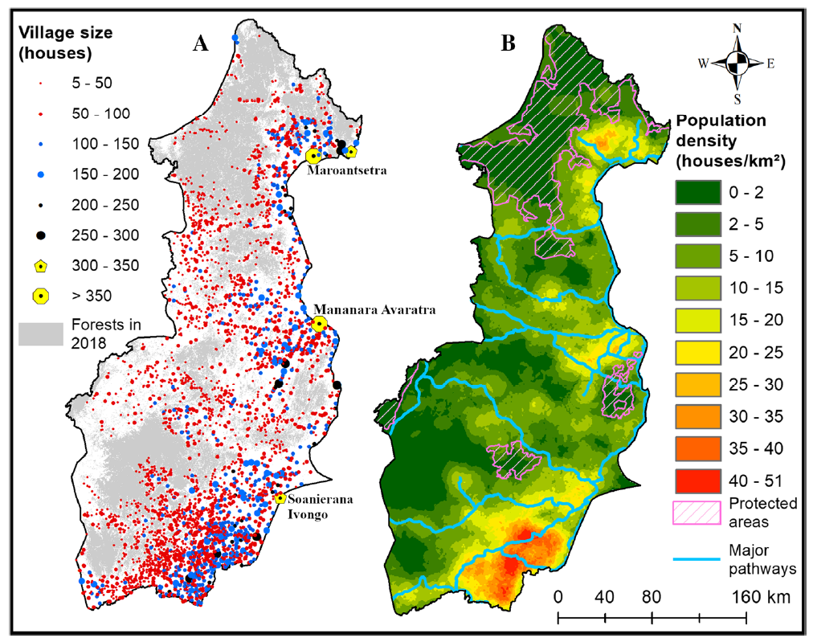

<div id="top"></div>


<!-- PROJECT LOGO -->
<br />
<div align="center">
  
  </a>

  <h3 align="center">Using the PrioritizR Package</h3>

  <p align="center">
    By: Daniël Kooij
  </p>
</div>


<!-- TABLE OF CONTENTS -->
<details>
  <summary>Table of Contents</summary>
  <ol>
    <li>
      <a href="#PPP">Preparing your first PriotizR Project</a>
      <ul>
        <li><a href="#built-with">Built With</a></li>
      </ul>
    </li>
    <li>
      <a href="#getting-started">Getting Started</a>
      <ul>
        <li><a href="#prerequisites">Prerequisites</a></li>
        <li><a href="#installation">Installation</a></li>
      </ul>
    </li>
    <li><a href="#usage">Usage</a></li>
    <li><a href="#roadmap">Roadmap</a></li>
    <li><a href="#contributing">Contributing</a></li>
    <li><a href="#license">License</a></li>
    <li><a href="#contact">Contact</a></li>
    <li><a href="#acknowledgments">Acknowledgments</a></li>
  </ol>
</details>


<!-- PPP -->
## Preparing your first PriotizR Project

In this section, we are going to explore step by step how linear programming (LP) can be implemented on a spatial scale. For this purpose, we will imagine the aforementioned task; indicating which areas of a forest should be protected in order to preserve .....the maximum amount of biodiversity? Suppose the forest in question is a perfect square of 10 by 10 kilometers, divided into grid cells of 1 km<sup>2</sup>. Each grid cell of forest may attain the _preserved_ status, but there can only be a limited amount of grid cells that can be preserved due to some constraint(s).

<br />

> Question 1. What might be a limiting factor for preservation? I.e. What could be a reason that we cannot preserve the whole forest?

<br />
<details>
<summary>Answer Q1.</summary>
There can be many limiting factors. Often there is money involved and the conservation costs are too high. However, there may be other reasons, such as: The entire forest cannot be managed and patrolled, or preservation could mean the preserved area would be fenced off and the government decided that at least _X_% of the forest should be remain open to the public. 
</details>

<br />

> Question 2. What kind of data (variables) would you like to know about each grid cell of forest to determine if it should be preserved or not? Name three different types of variables.

<br />
<details>
<summary>Answer Q2.</summary>
Depending on your LP problem, numerous types of variables can be of interest. In the case of this forest preservation task some examples can be: The number of trees in a grid cell (quantity), the number of endangered species present (quality), the (geo)diversity in the abiotic environment, the cost of protecting the 1km<sup>2</sup>, the distance to disturbances such as roads, the nutrient & water availability etc.
</details>

<br />

Now that we have a basic understanding of the data we could use to reach our objective (OBJECTIVE IS NOT CLEAR YET, MAXIMUM BIODIVERSITY?) of preserving the ... and possible constraints that limit our options, we can check how our conservation task would look in real life. In order to do so, we will make use of data that is already available in the PrioritizR package. Therefore, fire up Rstudio and load the PrioritizR library, now that we are at it, also load the Gurobi library which we will use to solve our LP problem later on.

```R
# load packages
library(prioritizr)
library(gurobi)
```

<br />
The data for our forest in question is divided into two parts; on the one hand we have the constraint(s) and data about whether a grid cell can be preserved or not. On the other hand we have different variables of interest that we can use to indicate which grid cells would be optimal to preserve in order to satisfy our objective to the fullest. In this case, the constraint is a matter of money, whereas we have a limited amount of cash available to preserve this forest and each grid cell costs a certain amount of money to be preserved. As you can imagine, the costs of preservation varies across the grid. This might be due to land costs; the forest is partly owned by foresters that should be bought out or compensated. Or this might be due to accessibility; some areas are harder to reach and the costs are higher to implement necessary magament practices. Let's assume the former scenario where land must be purchased and the costs are in thousands of euros per km<sup>2</sup>. With this in mind, we are going to take a look at the forest, but first we have to load the data:
<br />

```R
# load costs and planning unit data
data(sim_pu_polygons)
```

<br />
The data we just loaded will (hopefully) appear in the environment tab in the topright corner of your screen called _sim_pu_polygons_. This R object contains data about three variables for every single grid cell. The first variable is the cost to purchase each grid cell, which we going to check out now. This data is presented as polygons in a so called spatial vector format. For now that does not seem to make much difference as we will see a perfectly square forest with equally sized grid cells. However, this will come in handy when working with real data, as our world is often divided into areas that follow natural or man-made boundaries. By using this spatial vector format, it is possible to define polygons precisely matching the area in question, which we will see later on when we apply this to a case study. The function _spplot_ is able to visualize these polygons, now visualize the purchase costs per grid cell using the following code:
<br>

```R
# Show the purchase costs per km2
spplot(sim_pu_polygons, "cost", main = "Purchase costs per km2 multiplied by €1000",
       xlim = c(-0.1, 1.1), ylim = c(-0.1, 1.1))
```

<br>
This will have plotted the purchase costs visually using a gradient in the bottomright corner of Rstudio. The yellow areas are of high costs, while the blue areas are relatively cheaper (figure 2). The white grid cells cannot be bought, these could for instance consist of waterbodies that are not part of the forest and our management practices and are therefore not able to be preserved.

<br />
<br />
<div align="center">
  
  <br />
  <em>Figure 2. Overview of the purchasing costs of each square kilometer of forest</em>
</div>

<br />
It is also possible to access the data directly instead of visually inspecting the costs. First save the data of the polygons in a new variable using the code underneath, then use your existing knowledge about R to answer the following question.

```R
# Save the polygon data in an easily accessable variable
forest_cost <- sim_pu_polygons@data
```

> Question 3. What is the costs of the most expensive km<sup>2</sup> of forest? Mind the unit of measurement!

<br />
<details>
<summary>Answer Q3.</summary>
Using the function summary(forest_cost) for example, one can find that the maximum cost is €215900.
</details>

<br>
As you can see in the new _forest cost_ variable, there are also two other columns in the data; _locked_in_ and _locked_out_. The locked_in column describes whether a grid cell is already being protected or not. The locked_out column details whether a grid cell can be preserved at all, maybe there is a train track crossing the forest, which makes it impossible to protect the grid cells within which it lies. Now visualize the locked_in data similarly as how you visualized the purchase costs earlier, copy the code and change the necessary parts accordingly.

> Question 4. How many grid cells area already preserved?

<br>
<details>
<summary>Answer Q4.</summary>
If you count the colored cells in the visualized "locked-in" variable, one can find that the answer is ....
</details>

<br>
<br>

* Feature data
Conservation features are represented using a stack of raster data (i.e. RasterStack objects). A RasterStack represents a collection of RasterLayers with the same spatial properties (i.e. spatial extent, coordinate system, dimensionality, and resolution). Each RasterLayer in the stack describes the distribution of a conservation feature.

In our example, the sim_features object is a RasterStack object that contains 5 layers. Each RasterLayer describes the distribution of a species. Specifically, the pixel values denote the proportion of suitable habitat across different areas inside the study area. For a given layer, pixels with a value of one are comprised entirely of suitable habitat for the feature, and pixels with a value of zero contain no suitable habitat.

```R
# load feature data
data(sim_features)

# plot the distribution of suitable habitat for each feature
plot(sim_features, main = paste("Feature", seq_len(nlayers(sim_features))),
     nr = 2)
```
     
> Question 5. Upon visual inspection of the plots, which part of the forest would you not opt to preserve?
> a) The northeastern part
> b) The northwestern part
> c) The southeastern part
> d) The southwestern part

> Question 6. Why this area?
> a) This area has the highest costs.
> b) This area is most unsuitable to preserve. 
> c) Both _a_ and _b_ are correct.


In addition, 

There is a certain amount of costs to preserve each grid cell. 

To start with the 

stored in the package 
Our forest in question 


We will use the sim_pu_polygons object to represent our planning units. Although the prioritizr R can support many different types of planning unit data, here our planning units are represented as polygons in a spatial vector format (i.e. SpatialPolygonsDataFrame). Each polygon represents a different planning unit and we have 90 planning units in total. The attribute table associated with this dataset contains information describing the acquisition cost of each planning (“cost” column), and a value indicating if the unit is already located in protected area (“locked_in” column). Let’s explore the planning unit data.


Earlier this week you have learned what linear programming is all about. You have seen examples of some problems where an optimal solution can be found (INSERT EXAMPLE WHAT THEY DID). Finding the solution to a linear programming problem with limited amount of dimensions and constraints can be done even by hand (as you have seen this week??). However, when the number of dimensions and constraints keep increasing it becomes almost impossible to calculate the optimal solution(s). Moreover, the problem might even exceed the amount of computing power that is reasonably available to calculate all possible solutions to the problem. In that case, we need some sort of algorithm to scan the problem space in order to find an optimal solution. This is why we will use R in this module, to make use of algorithms that can solve linear programming problems for us. 

One of the fields were linear programming problems occur is in the field of conservation ecology. Imagine you are tasked by indicating which areas of a forest should be protected in order to preserve the maximum amount of biodiversity in this park. You open your prefered GIS software and import different kinds of maps to base your decision on. The imported maps show the occurence and observations of tens of different type of species, the spatial availability of various nutrients, soil maps, hydrological maps, land covers, and so forth... Where do you even start to determine the areas that are most important to preserve?
This is were linear programming in a statistical software comes in: By defining the objectives and constraints, a solution can be found using R. In this module we will look at spatial linear programming problems and solve those using a package specifically designed for conservation planning problems named: **PrioritizR**. Before we can start, we first need to install the **PrioritizR** package in R and also a software package called **Gurobi** that applies algorithms to efficiently solve the linear programming problems at hand.

<br />
<div align="center">
  
  <br />
  <em>Typical conservation planning problem, where protected areas are indicated in pink</em>
</div>

<br />


<!-- GETTING STARTED -->
## Getting Started

The latest official version of the prioritizr R package can be installed from the Comprehensive R Archive Network (CRAN) using the following R code. Copy the code and run it in Rstudio, make sure your R version is 4.+ (you probably already checked this previous week).

```R
# Install the prioritizr package
install.packages("prioritizr", repos = "https://cran.rstudio.com/")
```

### Gurobi

Next, we will need to install a so-called solver, which is software that uses algorithms to solve linear programming problems quickly. [Gurobi](https://www.gurobi.com/) is an example of such type of software, which we are going to install and use in this module. Gurobi is not open-source software, but academic users may register for a one-year free trial. In short, we will perform the following steps to install this software:

* Register for a free academic trial [Here](https://pages.gurobi.com/registration).
* Change your password with the email you receive.
* Login to the Gurobi website.
* Download the software: (https://www.gurobi.com/downloads/gurobi-software/)
* Go to (https://www.gurobi.com/downloads/free-academic-license/) and find your key under Installation.
* Open command prompt (Windows users can use the search function on laptop) and type: grbgetkey [your-key], where your-key is the key you found in the previous step.
* If all previous steps are completed, you succesfully installed the Gurobi software.

If you are not able to succesfully install the software, then a more elaborate installation guide can be found here:
* (https://prioritizr.net/articles/gurobi_installation.html)


### Installation

Once the software is installed on your laptop, the Gurobi package can be installed in Rstudio. Use the following code to install the latest version of the Gurobi software which is 9.5.0. to this date (**19/11/21**). You are probably prompted to also install dependencies like the package _slam_ in order to make the Gurobi package work, also install this package with the provided code.


```R
# Install Gurobi950
install.packages("c:/gurobi950/win64/R/gurobi_9.5-0.zip", repos = NULL)

# Install additionals
install.packages("slam", repos = "https://cloud.r-project.org")
```

If the packages are installed correctly, you can continue, if not; ask the teacher for assistance. 


<p align="center">(<a href="#top">back to top</a>)</p>


_Below is an example of how you can instruct your audience on installing and setting up your app. This template doesn't rely on any external dependencies or services._


3. Install NPM packages
   ```sh
   npm install
   ```
4. Enter your API in `config.js`
   ```js
   const API_KEY = 'ENTER YOUR API';
   ```

<p align="right">(<a href="#top">back to top</a>)</p>


<!-- USAGE EXAMPLES -->
## Usage

Use this space to show useful examples of how a project can be used. Additional screenshots, code examples and demos work well in this space. You may also link to more resources.

_For more examples, please refer to the [Documentation](https://example.com)_

<p align="right">(<a href="#top">back to top</a>)</p>


<!-- ROADMAP -->
## Roadmap

- [x] Add Changelog
- [x] Add back to top links
- [ ] Add Additional Templates w/ Examples
- [ ] Add "components" document to easily copy & paste sections of the readme
- [ ] Multi-language Support
    - [ ] Chinese
    - [ ] Spanish

See the [open issues](https://github.com/othneildrew/Best-README-Template/issues) for a full list of proposed features (and known issues).

<p align="right">(<a href="#top">back to top</a>)</p>


<!-- CONTRIBUTING -->
## Contributing

Contributions are what make the open source community such an amazing place to learn, inspire, and create. Any contributions you make are **greatly appreciated**.

If you have a suggestion that would make this better, please fork the repo and create a pull request. You can also simply open an issue with the tag "enhancement".
Don't forget to give the project a star! Thanks again!

1. Fork the Project
2. Create your Feature Branch (`git checkout -b feature/AmazingFeature`)
3. Commit your Changes (`git commit -m 'Add some AmazingFeature'`)
4. Push to the Branch (`git push origin feature/AmazingFeature`)
5. Open a Pull Request

<p align="right">(<a href="#top">back to top</a>)</p>


<!-- LICENSE -->
## License

Distributed under the MIT License. See `LICENSE.txt` for more information.

<p align="right">(<a href="#top">back to top</a>)</p>


<!-- CONTACT -->
## Contact

Your Name - [@your_twitter](https://twitter.com/your_username) - email@example.com

Project Link: [https://github.com/your_username/repo_name](https://github.com/your_username/repo_name)

<p align="right">(<a href="#top">back to top</a>)</p>


<!-- ACKNOWLEDGMENTS -->
## Acknowledgments

Use this space to list resources you find helpful and would like to give credit to. I've included a few of my favorites to kick things off!

* [Choose an Open Source License](https://choosealicense.com)
* [GitHub Emoji Cheat Sheet](https://www.webpagefx.com/tools/emoji-cheat-sheet)
* [Malven's Flexbox Cheatsheet](https://flexbox.malven.co/)
* [Malven's Grid Cheatsheet](https://grid.malven.co/)
* [Img Shields](https://shields.io)
* [GitHub Pages](https://pages.github.com)
* [Font Awesome](https://fontawesome.com)
* [React Icons](https://react-icons.github.io/react-icons/search)

<p align="right">(<a href="#top">back to top</a>)</p>


<!-- MARKDOWN LINKS & IMAGES -->
<!-- https://www.markdownguide.org/basic-syntax/#reference-style-links -->
[contributors-shield]: https://img.shields.io/github/contributors/othneildrew/Best-README-Template.svg?style=for-the-badge
[contributors-url]: https://github.com/othneildrew/Best-README-Template/graphs/contributors
[forks-shield]: https://img.shields.io/github/forks/othneildrew/Best-README-Template.svg?style=for-the-badge
[forks-url]: https://github.com/othneildrew/Best-README-Template/network/members
[stars-shield]: https://img.shields.io/github/stars/othneildrew/Best-README-Template.svg?style=for-the-badge
[stars-url]: https://github.com/othneildrew/Best-README-Template/stargazers
[issues-shield]: https://img.shields.io/github/issues/othneildrew/Best-README-Template.svg?style=for-the-badge
[issues-url]: https://github.com/othneildrew/Best-README-Template/issues
[license-shield]: https://img.shields.io/github/license/othneildrew/Best-README-Template.svg?style=for-the-badge
[license-url]: https://github.com/othneildrew/Best-README-Template/blob/master/LICENSE.txt
[linkedin-shield]: https://img.shields.io/badge/-LinkedIn-black.svg?style=for-the-badge&logo=linkedin&colorB=555
[linkedin-url]: https://linkedin.com/in/othneildrew
[product-screenshot]: images/screenshot.png
