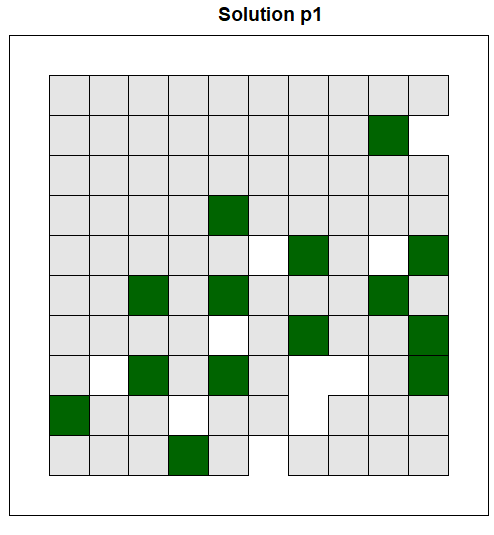

<div id="top"></div>


<!-- PROJECT LOGO -->
<br />
<div align="center">
  
  </a>

  <h3 align="center">Using the PrioritizR Package</h3>

  <p align="center">
    By: Daniël Kooij
  </p>
</div>


<!-- TABLE OF CONTENTS -->
<details>
  <summary>Table of Contents</summary>
  <ol>
    <li>
      <a href="#PPP">Preparing your first PriotizR Project</a>
      <ul>
        <li><a href="Inspecting">Inspecting the data</a></li>
        <li><a href="Feature">Feature data</a></li>
      </ul>
    </li>
    <li>
      <a href="#Problem">Defining the problem</a>
    </li>
    <li>
      <a href="#Cons Pros">Constraints & Objectives</a>      
      <ul>
        <li><a href="#Fragmentation">Fragmentation</a></li>
      </ul>
    </li>
  </ol>
</details>


<!-- PPP -->
## Preparing your first PriotizR Project

In this section, we are going to explore step by step how linear programming (LP) can be implemented on a spatial scale. For this purpose, we will imagine the aforementioned task; indicating which areas of a forest should be protected in order to preserve the maximum amount of biodiversity. Suppose the forest in question is a perfect square of 10 by 10 kilometers, divided into grid cells of 1 km<sup>2</sup>. Each grid cell of forest may attain the _preserved_ status, but there can only be a limited amount of grid cells that can be preserved due to some constraint(s).

<br />

> Question 1. What might be a limiting factor for preservation? I.e. What could be a reason that we cannot preserve the whole forest?

<br />
<details>
<summary>Answer Q1.</summary>
Answers will be added later on.
</details>

<br />

> Question 2. What kind of data (variables) would you like to know about each grid cell of forest to determine if it should be preserved or not? Name three different types of variables.

<br />
<details>
<summary>Answer Q2.</summary>
Answers will be added later on.
</details>

<br />

Now that we have a basic understanding of the data we could use to reach our objective of preserving the maximum amount of biodiversity and possible constraints that limit our options, we can check how our conservation task would look in real life. In order to do so, we will make use of data that is already available in the PrioritizR package. Therefore, fire up Rstudio and load the PrioritizR library, now that we are at it, also load the Gurobi library which we will use to solve our LP problem later on.

```R
# load packages
library(prioritizr)
library(gurobi)
```

<br />

<!-- INSPECTING -->
### Inspecting the data

The data for our forest in question is divided into two parts; on the one hand we have the constraint(s) and data about whether a grid cell can be preserved or not. On the other hand we have different variables of interest that we can use to indicate which grid cells would be optimal to preserve in order to satisfy our objective to the fullest. In this case, the constraint is a matter of money, whereas we have a limited amount of cash available to preserve this forest and each grid cell costs a certain amount of money to be preserved. As you can imagine, the costs of preservation varies across the grid. This might be due to land costs; for example if the forest is partly owned by foresters that should be bought out or compensated. Or this might be due to accessibility; in case some areas are harder to reach and the costs are higher to implement necessary management practices. Let's assume the former scenario where land must be purchased and the costs are in thousands of euros per km<sup>2</sup>. With this in mind, we are going to take a look at the forest, but first we have to load the data:

```R
# load costs and planning unit data
data(sim_pu_polygons)
```

<br />

The data we just loaded will (hopefully) appear in the environment tab in the topright corner of your screen called _sim_pu_polygons_. This R object contains data about three variables for every single grid cell. The first variable is the cost to purchase each grid cell, which we going to check out now. This data is presented as polygons in a so called spatial vector format. For now that does not seem to make much difference as we will see a perfectly square forest with equally sized grid cells. However, this will come in handy when working with real data, as our world is often divided into areas that follow natural or man-made boundaries. By using this spatial vector format, it is possible to define polygons precisely matching the area in question, which we will see later on when we apply this to a case study. The function _spplot_ is able to visualize these polygons, now visualize the purchase costs per grid cell using the following code:

```R
# Show the purchase costs per km2
spplot(sim_pu_polygons, "cost", main = "Purchase costs per km2 multiplied by €1000",
       xlim = c(-0.1, 1.1), ylim = c(-0.1, 1.1))
```

<br />

This will have plotted the purchase costs visually using a gradient in the bottomright corner of Rstudio. The yellow areas are of high costs, while the blue areas are relatively cheaper (figure 2). The white grid cells cannot be bought, these could for instance consist of waterbodies that are not part of the forest and our management practices and are therefore not able to be preserved.

<br />
<br />

<div align="center">
  
  <br />
  <em>Figure 2. Overview of the purchasing costs of each square kilometer of forest</em>
</div>

<br />
<br />

It is also possible to access the data directly instead of visually inspecting the costs. First save the data of the polygons in a new variable using the code underneath, then use your existing knowledge about R to answer the following question.

```R
# Save the polygon data in an easily accessable variable
forest_cost <- sim_pu_polygons@data
```

<br />

> Question 3. What is the costs of the most expensive km<sup>2</sup> of forest? Mind the unit of measurement!

<br />
<details>
<summary>Answer Q3.</summary>
Answers will be added later on.
</details>

<br />

As you can see in the new _forest cost_ variable, there are also two other columns in the data; _locked_in_ and _locked_out_. The locked_in column describes whether a grid cell needs to be protected or not (due to other reasons outside the scope of our objective). The locked_out column details whether a grid cell can be preserved at all, maybe there is a train track crossing the forest, which makes it impossible to protect the grid cells within which it lies. Now visualize the locked_in data similarly as how you visualized the purchase costs earlier, copy the code and change the necessary parts accordingly.

<br />

> Question 4. How many grid cells are already designated to be conserved?

<br />
<details>
<summary>Answer Q4.</summary>
Answers will be added later on.
</details>

<br />
<br />

<!-- Feature -->
### Feature data

You just visualized the costs of each square kilometer of forest, but this variable is not the only variable of interest in our conservation planning problem. If all the raster cells are equally worth preserving, than the planning problem becomes quite easy to solve; just select the cheapest cells, such that you can preserve the maximum amount of area for _X_ amount of money. However, in order to save the maximum amount of biodiversity, one area might be more suitable to preserve than another. In that case it could be worth to preserve the more suitable area even though the costs are higher. As mentioned earlier, the variables that determine suitability may consist of different types of data (ecological, hydrological, pedological data etc.) and their relevance depend on the problem to be solved. For our task, the data of interest is already provided by the prioritizr package, load the data as follows:

```R
# Load feature data
data(sim_features)
```
<br />

This data consists of five different layers, with each layer indicating the habitat suitability of a specific species. The suitability for each species is estimated on a plethora of variables and ranges from 0 (not suitable) to 1 (very suitable). We can check the range of values for the suitability using the following command:

```R
# Check feature data
sim_features@layers
```
<br />

> Question 5. Which layer contains the highest suitability value?

<br />
<details>
<summary>Answer Q5.</summary>
Answers will be added later on.
</details>

<br />

Similarly as the cost data, the suitability layers contain spatial information (i.e. spatial extent, coordinate system and resolution) which we can use to plot the suitability maps and investigate their spatial differences. As you can imagine, the most optimal square kilometer of forest to conserve is the cell that contains the highest suitability values for each of the five species. It is possible to plot all the five suitability layers at the same time using the following code:

```R
# plot the distribution of suitable habitat for each feature
plot(sim_features, main = paste("Suitability map", c("first", "second", "third", "fourth", "fifth"),"species"))
```

<br />

> Question 6. Upon visual inspection of the plots, which part of the forest would you **not** opt to preserve? <br />
> <br />
> a) The northeastern part <br />
> b) The northwestern part <br />
> c) The southeastern part <br />
> d) The southwestern part <br />

<br />
<details>
<summary>Answer Q6.</summary>
Answers will be added later on.
</details>

<br />

> Question 7. Why this area? <br />
> <br />
> a) This area has the highest costs. <br />
> b) This area is most unsuitable to preserve. <br />
> c) Both _a_ and _b_ are correct. <br />

<br />
<details>
<summary>Answer Q7.</summary>
Answers will be added later on.
</details>

<br />

<!-- Problem -->
## Defining the problem

Maybe you noticed when looking at the suitability maps and data, that the ranges in suitability values differ among the species. This influences the way in which we want to solve the problem at hand. In plain words, our objective is to maximize the amount of biodiversity, but we need to translate this into a function in order to solve it in R. If we would define the objective as: maximize(suitability first species + suitability second species + ..._n_ species), then the relative importance of the first species in this formula is way higher than the second, as the suitability of the first species is on average twice as high as the second (check this yourself with the legend of the suitability maps). This would result, for example, in preserving areas with high suitability for the first species, while the suitability for the second species doesn't really matter. In that case it could happen that an area with a suitability of 1 for the first species and 0 suitability for the others (total = 1.0), would be preserved over an area with a suitability of 0.15 for each of the species (total = 0.75). The former would only preserve one species very well while in the latter case, five species would be marginally preserved. Yet we are trying to maximize biodiversity and preserving only one species seems to be the opposite of that! Therefore we need to adjust the objective to account for these differences.

> Question 8. How would you define the objective such that all species are included?

<br />
<details>
<summary>Answer Q8.</summary>
Answers will be added later on.
</details>

One way to deal with this dilemma is to set relative targets for each of the species. For instance, we can define a target that at least 15% of the total suitability for each species should be conserved. While we aim to reach this target, we are still constrained by the amount of money that we can spend on conservation. Earlier you saw that the cells costs are in thousands of euros. Let's assume that the Forestry Service that commissioned this task has 3 million euros to spend on conservation; any cell can be bought, as long as the total spending is less than 3 million. Therefore the objective is to preserve as much suitability relative for each species that 3 million euro's can buy. It is interesting to note that the size of the area doesn't matter in this objective, as long as >15% suitability / species is preserved, the objective is reached. Therefore this objective focuses on quality over quantity.

With the objective and constraints in mind, we can now start to define our problem in R. First, let's make a summary of the various parts of our problem.

* 1 - We have data on the costs per km<sup>2</sup> of forest.
* 2 - We also have data on the suitability ratio for five species per km<sup>2</sup>.
* 3 - There is a constraint that we cannot spend more than 3000 (x1000's of euros = 3mil).
* 4 - The aim is to preserve at least 15% of the suitability for each species to achieve maximum conservation of biodiversity.
* 5 - The square kilometers of forest can either be bought or not bought, there is no in between.

<br />

The order in which the summary is made, is quite similar as the order in which we will enter our problem in R. The prioritizR package contains the function _problem_ in which the first arguments are the data of the costs (sim_pu_polygons [1]) and the features (sim_features [2]). Then we add the constraint of our funds (add_min_shortfall_objective [3]) and the relative targets of 15% for each of the species (add_relative_targets [4]). In this planning scenario, we can either purchase all of the land inside a given planning unit, or none of the land inside a given planning unit, which we should also inform R about (add_binary_decisions [5]). All in all, our problem definition (p1) in R can be defined by the code below, which we are going to solve with Gurobi, our default solver that we installed earlier (add_default_solver).

<br />

```R
# create conservation planning problem
p1 <- problem(sim_pu_polygons, sim_features, cost_column = "cost") %>%
  add_min_shortfall_objective(3000) %>%
  add_relative_targets(0.15) %>%
  add_binary_decisions() %>%
  add_default_solver()
```

As you can notice, the code above makes use of a so-called [pipe](https://prioritizr.net/reference/pipe.html) operator: _%>%_, which allows us to add arguments to a function that is already denoted. The convenience of using the pipe operator allows you to modify a part of the function without rewriting and evaluating the entire function with all its argument.     

<br />
<br />

<div align="center">
  
  <br />
  <em>Figure 3. Example of how a problem definition translates into R code</em>
</div>

<br />

Our Gurobi solver has been waiting to crunch some numbers, it is time to solve this conservation problem! The modest code below will activate Gurobi to solve the problem using the simplex algorithm.

```R
# Solve the problem (p1)
s1 <- solve(p1)
```

<br />

Basically what Gurobi tried to solve is: Specify areas that will secure at least 15% of the optimal suitability of each species in the study area for less than 3 million in cost. To see whether that objective is fullfilled we can look at the solution which is stored in the solution variable _s1_. The areas that should be conserved, according to the optimal solution that Gurobi found, are saved in _solution_1_, which we can visualize using the following R code:

```R
# plot the solution
spplot(s1, "solution_1", main = "Solution p1", at = c(0, 0.5, 1.1),
       col.regions = c("grey90", "darkgreen"), xlim = c(-0.1, 1.1),
       ylim = c(-0.1, 1.1))
```

<br />

If everything went correctly, you will see figure 4; our study area with green colored cells that indicate the areas that should be conserved to maximize biodiversity.

<div align="center">
  
  <br />
  <em>Figure 4. Optimal solution for problem p1, green cells indicate the areas that should be conserved</em>
</div>

<br />

<br />

While it is interesting to see the spatial distribution of the proposed conservation areas, this plot doesn't tell us whether or not we have achieved our objective. The Forest Service might want to know the total cost of this conservation plan and how suitable the areas are for each of the species. It is possible to retrieve this information from the solution and print it in R.

```R
# Retrieve summary statistics of the solution
print(eval_cost_summary(p1, s1[, "solution_1"]), width = Inf)
print(eval_target_coverage_summary(p1, s1[, "solution_1"]), width = Inf)
```

<br />

The first print statement shows the total cost of this optimal solution, this proposed plan would cost 2.85 million euros in total (check this yourself). The second print statement shows a summary of the targets and to what extent they were achieved. Starting on the left side, we see five layers, each row indicating the suitability of one of the species. The second column shows the total amount of suitability, which is the suitability per cell (which ranges from 0 - 1) summed together over the raster. This value doesn't provide us much information, except we aimed to achieve 15% of this total suitability for each species in our solution. The two columns besides this shows the target in total suitability and how much we actually achieved with the solution. While the numbers are not a directly interesting statistic, you may already be able to tell that this solution 'holds' more suitability than the target that we set. In this case, it is more interesting to see how much of the relative targets have been achieved as these are directly interpretable. From the printed statistics it is clear that our solution (_relative_held_) is greater than the set target of 15% (_relative_target_). In other cases the absolute values of the targets might be of more interest, for example when you are tasked to preserve as much natural carbon storage as possible and you have maps indicating the carbon storage per cell for different vegetation types. Then the _absolute_held_ column will indicate how much carbon you preserve in tons or kilograms with your solution.

<br />

> Question 9. For which species has the relative target been achieved the most? For the: <br />
> <br />
> a) First species <br />
> b) Second species <br />
> c) Third species <br />
> d) Fourth species <br />
> e) Fifth species <br />

<br />
<details>
<summary>Answer Q9.</summary>
Answers will be added later on.
</details>

<br />

<br />

<!-- Cons Pros -->
## Constraints & Objectives

You've successfully solved your first spatial conservation planning problem! However, the problem is not solved yet, there's more to explore. While the solution you found might be optimal for the defined problem, the proposed areas for conservation sketches just one scenario. It would be useful to consider more than one scenario, and there may be constraints and objectives that we have not anticipated, which changes the problem definition.

<br />

One of the constraints that we have not considered yet, is the fact that some some of the planning units are already designated to be conserved. Since our planning unit data contains information on which planning units are already designated (in the _locked_in_ variable you plotted earlier), we can add constraints to ensure they are prioritized in the solution (add_locked_in_constraints). In the code below you can see how we can add a new constraint to our planning problem using the pipe function without having to declare all the parameters again.

```R
# create new problem with locked in constraints added to it
p2 <- p1 %>%
      add_locked_in_constraints("locked_in")

# solve the problem
s2 <- solve(p2)
```

<br />

> Question 10. What are the costs of the solution where the already designated areas to be conserved are included? Are all the relative targets reached?

<br />
<details>
<summary>Answer Q10.</summary>
Answers will be added later on.
</details>

<br />

**phone rings**, hello? hmm.. yes, what's that? oh OK. <br />
The Forestry Service just called, they want to notify us that their expenses for this project are cut by one-third and that only 2 million euros are left for conservation measures. Furthermore, they inform us that the designated _locked_in_ areas are not important anymore, we can select any area that is most optimal for conservation. Try to solve this new scenario, use defined problem _p1_ (without the locked-in constraints) to define problem _p3_, taking the new budget into consideration.

```R
# Conservation problem with the cut budget.
p3 <- p1 %>% what_comes_here(questionmark)
```

<br />

> Question 11. How many square kilometers of forest are proposed for conservation with the limited budget?

<br />
<details>
<summary>Answer Q11.</summary>
Answers will be added later on.
</details>

<br />

Now print the costs and targets of this solution like you did earlier, then take a look at the summary statistics of the optimal solution for this problem. It seems that due to our limited budget, we are not able to achieve the targets we have set. Since the budget is not sufficient, this solution is the best we can do for this amount of money.

<br />

> Question 12. What is the average percentage of suitability achieved for the five species?

<br />
<details>
<summary>Answer Q12.</summary>
Answers will be added later on.
</details>

<br />

### Fragmentation

If you would look back at the first solution (figure 4), it is rather clear that the proposed areas are highly fragmented. As a consequence, this solution may be associated with increased management costs and the species in this scenario may not benefit substantially from this solution due to edge effects. These edge effects and other consequences due to fragmentation are not yet included in our problem definition, yet we know from various studies that these impacts should be taken into consideration. Somehow we should try to limit the amount of fragmentation by adding another parameter to the problem definition. To do so, it is important to have a clear idea of how to define fragmentation mathematically to penalize solutions with high levels of fragmentation.

> Question 13. How would you reduce fragmentation? Provide a (mathematical) expression that would limit the amount of fragmentation. It helps to think of an equation you want to maximize or minimize.

<br />
<details>
<summary>Answer Q13.</summary>
Answers will be added later on.
</details>

<br />

Since the effects of fragmentation is a common dilemma in conservation ecology, the prioritizR package already contains a parameter which we can use to minimize fragmentation (_add_boundary_penalties_). This parameter adds a penalty that punish overly fragmented solutions. Here we will use a penalty factor of 0.00001 (i.e. boundary length modifier; search this up if you are interested), and an edge factor of 50% so that planning units that occur at the outer edge of the study area are not overly penalized.

```R
# create new problem with boundary penalties added to it
p4 <- p1 %>%
  add_boundary_penalties(penalty = 0.00001, edge_factor = 0.5)
```

<br />

This solution looks better than the first solution when considering fragmentation. However, this solution does not maintain connectivity between reserves, and so species may have limited capacity to disperse throughout the solution. To avoid this, we can add a contiguity constraints (_add_contiguity_constraints_) that enforces the solution to have all preservation areas connected to each other. The areas are connected when each preserved area is located in one of the 8 cells around another preserved area. Use the code below and visualize the solution again.

```R
# create new problem with contiguity constraints
p5 <- p1 %>%
  add_contiguity_constraints()
```

<br />

Well done! You have used linear programming in R to solve multiple conservation problems using different objectives and constraints; a task that would be quite impossible to do by hand, especially when area or resolution scales up.

_You gained 1 level up in conservation ecology._

<br />

<p align="center">(<a href="#top">back to top</a>)</p>
